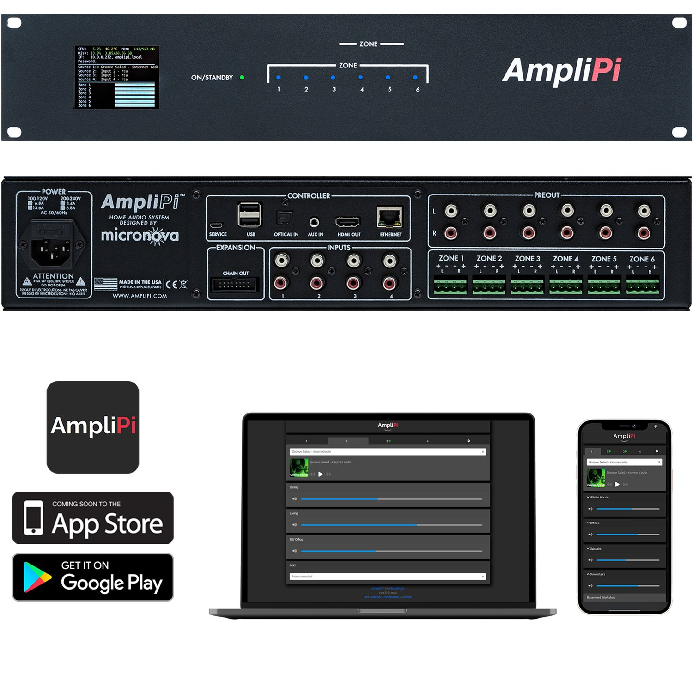

# AmpliPi Home Audio System
[![Build Status][workflow-badge]][workflow-link] [![Coverage][coverage-badge]][coverage-link] [![GPL License][license-badge]](COPYING)

AmpliPi™ is a multi room/zone home audio controller and amplifier made for whole house audio systems with many zones. It can play up to 4 simultaneous audio sources, each of which can be selected from either its analog RCA input or any supported digital stream (Pandora, Spotify, AirPlay, etc). Each source can be routed to one or more zones, all of which are configurable in real-time using the self-hosted AmpliPi Web App or its underlying REST API. It is expandable up to 36 zones using AmpliPi Zone Expanders.

The AmpliPi design is entirely open source, from the software, to the firmware, to the schematics. The REST API and Web App are written in Python and run on a Raspberry Pi 3+ Compute Module. The firmware, which provides the low level volume control and zone configuration, is written in C and configured by the Python API over I2C. All of the internal circuitry comes with full schematics (available in this repo).

The system is self-hosted on the Raspberry Pi and is privacy-centric. By design, AmpliPi doesn’t listen to you or spy on you — it just plays your audio! The way it should be. An internet connection is only needed for some external streaming sources, such as Pandora. The Python application running on the Pi hosts a mobile-friendly website and REST API used to control the system. The website is built on top of the REST API.

Check us out on [Kickstarter](https://www.kickstarter.com/projects/micro-nova/amplipi-home-audio-system)!

## Features

AmpliPi can play many different types of digital streaming inputs. Most of the streaming services supported can be played as independent digital streams on all four sources at once; check out the **Multiple?** heading. Below is the current status of our digital stream integrations.

Most of these digital streaming services are provided by other open-source projects; check out the **Provided By** heading.

|Streaming Service|Supported|Multiple?|Metadata|Provided By|Notes|
|--|--:|--:|--:|--|--|
|Pandora|Yes|Yes|Yes|[Pianobar](https://github.com/PromyLOPh/pianobar)||
|Airplay|Yes|Yes|Yes|[Shairport-sync](https://github.com/mikebrady/shairport-sync)|Metadata only available from iTunes|
|Spotify|Yes|Yes|Yes|[Librespot](https://github.com/librespot-org/librespot)|Requires Spotify Premium, one account per stream. See [disclaimer](https://github.com/librespot-org/librespot#disclaimer)|
|DLNA|Yes|Yes|Yes|[gmrender-resurrect](https://github.com/hzeller/gmrender-resurrect)||
|Internet Radio|Yes|Yes|Yes|[VLC](https://github.com/videolan/vlc)||
|Plexamp|No|No|No|[Plexamp](https://plexamp.com/)|See [#200](http://github.com/micro-nova/AmpliPi/issues/200)|
|FM Radio|Yes|No|Yes|[rtl-sdr](https://osmocom.org/projects/rtl-sdr/wiki/Rtl-sdr)/[redsea](https://github.com/windytan/redsea)|Requires [RTL SDR](https://www.rtl-sdr.com/buy-rtl-sdr-dvb-t-dongles/) compatible USB device|
|LMS|Yes|Yes|No|[squeezelite](https://github.com/ralph-irving/squeezelite)|Requires separate LMS Server|
|Google Cast|No||||Need to investigate|
|Offline Music|No||||See [#66](http://github.com/micro-nova/AmpliPi/issues/66)|
|TIDAL|No||||See [#87](http://github.com/micro-nova/AmpliPi/issues/87)|
|Bluetooth|No||||See [#150](http://github.com/micro-nova/AmpliPi/issues/150)|

In the future we plan to integrate with several home automation systems. Below is their current status.

|Integrations|Supported|Notes|
|--|--:|--|
|Home Assistant|Yes|See https://github.com/brianhealey/hacs_amplipi|
|openHAB|Yes|See https://next.openhab.org/addons/bindings/amplipi/|
|Alexa|No|See [#25](http://github.com/micro-nova/AmpliPi/issues/25)|
|Google Assistant|No|See [#69](http://github.com/micro-nova/AmpliPi/issues/69)|

## Quick Start Guide

If you are one of the lucky few to have a pre-release version of the AmpliPi,
see [docs/QUICK_START.md](docs/QUICK_START.md) to get started.

## Wall Panel

Check out our open source wall panel [here](https://github.com/micro-nova/AmpliPiWallPanel)!

  
  </img>

## Speakers

Notes on picking and installing speakers for whole house audio can be found [here](docs/SPEAKERS.md).

## Developing

For details on how to help out with new features and bug fixes, check out [docs/DEVELOPING.md](docs/DEVELOPING.md).

## Web interface
AmpliPi hosts a mobile-friendly web app that can control the system from any PC or mobile phone on the local network. Its design was based on the idea that each of the four audio sources could be controlled separately by different people in the house. Each audio source's controls are in their own tab at the top of the app.

Here's an example of changing group and zone volumes:

  
  </img>

Check out the full documentation for the web app at [docs/WEB_APP.md](docs/WEB_APP.md).

## The REST API
AmpliPi has a REST API that can be used to control volumes, switch and control audio sources, configure different streaming sources, and much more. It allows full configuration and real-time control of the AmpliPi device. The API conforms to the OpenAPI standard. It is fully documented on our [AmpliPi OpenAPI site](https://micro-nova.github.io/AmpliPi).

  
  </img>

With the REST API, you can easily add automation to your home audio system. Use the API to trigger your AmpliPi system to play music based on smart home events. For example, only play music in zones of your house where motion has been detected, or start playing Pandora when the front door is unlocked.

Not quite sure how to accomplish this? No problem - The AmpliPi controller hosts its API documentation as well. Using a web browser pointed at your local AmpliPi box, you can view the API documentation, as well as test sending and receiving API commands to and from the AmpliPi.

[workflow-badge]:  https://github.com/micro-nova/AmpliPi/actions/workflows/python-app.yml/badge.svg
[workflow-link]:   https://github.com/micro-nova/AmpliPi/actions?query=workflow%3Apython-app.yml
[coverage-badge]:  https://codecov.io/github/micro-nova/AmpliPi/coverage.svg?branch=master
[coverage-link]:   https://codecov.io/github/micro-nova/AmpliPi?branch=master
[license-badge]:   https://img.shields.io/badge/License-GPL%20v3-blue.svg

## Updates and Releases
Releases are available on [GitHub](https://github.com/micro-nova/AmpliPi/releases), see [CHANGELOG.md](CHANGELOG.md)
for the changes in each release.

To update you AmpliPi to the latest version:
1. Go to the web app at [amplipi.local](http://amplipi.local).
1. Click the gear icon (⚙) in the upper right corner to go to the configuration page
1. Select **Updates** and click the **Check for Updates** button
1. Click the **Update** button

If you don't see an update button, you have an older version of AmpliPi. It will take a couple more steps to update this time around.
1. From a laptop or desktop computer download this [update](https://github.com/micro-nova/AmpliPi/archive/refs/tags/0.1.9-uv-hotfix.tar.gz).
1. Click the browse button to select the downloaded AmpliPi-0.1.9-uv-hotfix.tar.gz file.
1. Click upload software to start the update, when it is finished it will navigate to the updated web app.
1. Please be patient, updates can take 20-30 minutes and progress info will be reported slowly.
1. The update will mistakenly fail with the message "`Error checking version: NetworkError when attempting to fetch resource`". Just go back to the app at [amplipi.local](http://amplipi.local) to enjoy the new feaures.

For custom changes or offline updating, a .tar.gz file can also be uploaded
to the AmpliPi. This can be generated from a git checkout with
`poetry version prerelease && poetry build`. The release will be generated to the dist folder.
