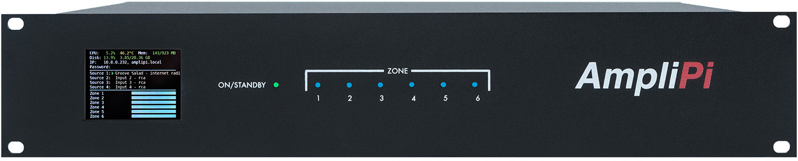
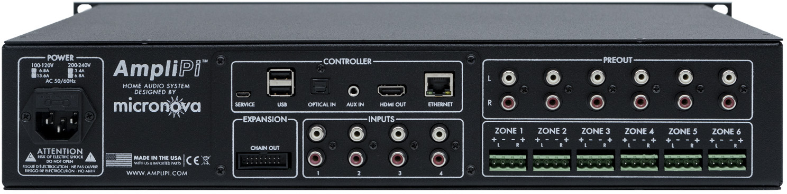

## Main Controller
### Front Panel

- **DISPLAY**: Show IP Address, Hostname, Password, audio info and zone volumes.
- **ON/STANDBY**: Show state of the audio controller:
    - Green: Unit is on
    - Red: Unit is in Standby
    - Blinking Red: Unit is waiting to be configured
- **ZONE**: Show powered state of each zone
    - Blue: Zone is on (not muted)
    - None: Zone is off (muted)

### Rear Panel

- **POWER**: 115V, or optionally 230V connection. An internal 115/230 switch is set internally on the power supply and marked on the rear of the unit.
- **CONTROLLER**: Connections to the embedded Raspberry Pi Controller.
- **SERVICE**: USB mini connection for re-imaging the Pi's EMMC.
- **USB**: USB A ports for connecting peripherals such as additional storage devices.
- **OPTICAL IN**: SPDIF audio input, planned to be used for extra inputs.
- **AUX IN**: Additional stereo input, planned to be used for announcements.
- **HDMI OUT**: The Pi's HDMI output, can be used for visualizations or development.
- **ETHERNET**: Network connection.
- **INPUTS**: 4 Stereo RCA inputs.
- **PREOUT**: Unamplified zone audio outputs, intended for powered speakers/subwoofers.
- **ZONE X**: Amplified stereo outputs for Zone X, using 4-pin Phoenix connectors.
- **EXPANSION**:
    - **CHAIN OUT**: Connection to the next expansion unit (if one or more expanders are needed).
